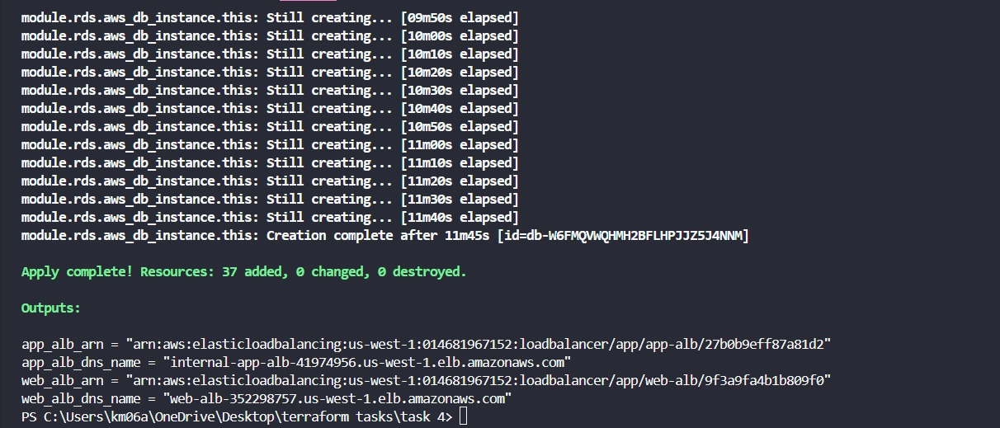
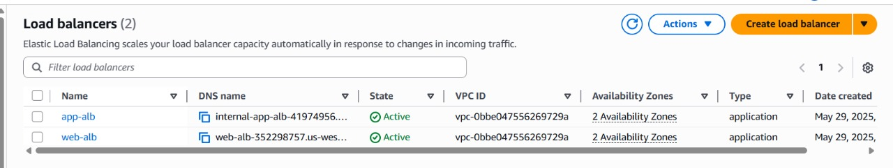
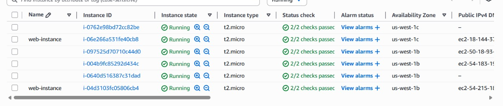

# Terraform AWS Multi-Region Infrastructure

## Deployed Resources

This configuration provisions the following AWS resources:

- **Region**: 1
- **Availability Zones**: 2
- **VPC**: 1
- **Subnets**:
    - 1 Public Subnet per AZ (Web Tier)
    - 1 Private Subnet per AZ (App Tier)
    - 1 Private Subnet per AZ (DB Tier)
- **Networking**:
    - Internet Gateway (IGW) attached to the VPC
    - NAT Gateway in each Public Subnet
    - Route Tables for each Subnet
    - Routes:
        - Public Subnets: via IGW
        - Private Subnets: via NAT Gateway
- **Compute**:
    - Launch Templates
    - Auto Scaling Groups (ASGs) for Frontend & Backend EC2 instances
- **Load Balancing**:
    - Public Application Load Balancer (ALB) for Web Tier
    - Private Application Load Balancer (ALB) for App Tier
    - HTTP/HTTPS Listeners and Rules
    - Target Groups for ASGs
- **EC2 Instances**:
    - Configuration: AMI, Instance Type, SSH Key Pair
    - Tier-specific network configurations

---

## Project Structure

The project is organized as follows:

```bash
├── .TASK 4/                      # Terraform working directory (auto-generated)
├── modules/                         # Reusable infrastructure modules
│   ├── alb/
│   ├── computing/
│   ├── networking/
│   ├── rds/
│   ├── security/
│   └── vpc/
├── main.tf                          # Root Terraform config
├── outputs.tf                       # Output variables
├── provider.tf                      # Provider and backend settings
├── README.md                        # Project documentation
├── terraform.tfvars                 # Environment-specific input variables           
├── variables.tf                     # Variable declarations
```

## Key Benefits

-   **Multi-AZ Deployment**: Enhances availability and resilience, minimizing downtime from AZ failures and enabling automatic failover for services like RDS.
-   **Modular Design**: Promotes code reuse, simplifies infrastructure maintenance, and streamlines updates to components such as ALBs and RDS.

---

# Deployment Steps

To deploy the infrastructure, execute the following Terraform commands:

### 1. Initialize Terraform
```bash
terraform init
```
This command initializes the Terraform working directory, downloading necessary provider plugins.

### 2. Review Execution Plan
```bash
terraform plan
```
This command creates an execution plan, allowing you to preview the changes Terraform will make to your infrastructure.

### 3. Apply Configuration
```bash
terraform apply -auto-approve
```
This command applies the changes defined in your Terraform configuration to create or update resources. The `-auto-approve` flag skips interactive approval.

## Expected Output
After successful execution of the commands, the AWS resources will be provisioned as per the configuration. The console output will reflect the creation and status of these resources, similar to the examples shown in the images below.



